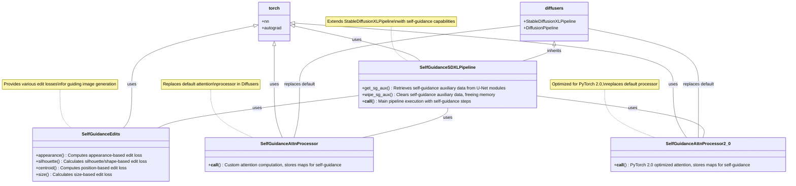

```mermaid
classDiagram
    class torch {
        +nn
        +autograd
    }
    class diffusers {
        +StableDiffusionXLPipeline
        +DiffusionPipeline
    }
    class SelfGuidanceSDXLPipeline {
        +get_sg_aux() Retrieves self-guidance auxiliary data from U-Net modules
        +wipe_sg_aux() Clears self-guidance auxiliary data, freeing memory
        +__call__() Main pipeline execution with self-guidance steps
    }
    class SelfGuidanceEdits {
        +appearance() Computes appearance-based edit loss
        +silhouette() Calculates silhouette/shape-based edit loss
        +centroid() Computes position-based edit loss
        +size() Calculates size-based edit loss
    }
    class SelfGuidanceAttnProcessor {
        +__call__() Custom attention computation, stores maps for self-guidance
    }
    class SelfGuidanceAttnProcessor2_0 {
        +__call__() PyTorch 2.0 optimized attention, stores maps for self-guidance
    }

    torch <|-- SelfGuidanceSDXLPipeline : uses
    torch <|-- SelfGuidanceEdits : uses
    torch <|-- SelfGuidanceAttnProcessor : uses
    torch <|-- SelfGuidanceAttnProcessor2_0 : uses
    diffusers <|-- SelfGuidanceSDXLPipeline : inherits
    diffusers -- SelfGuidanceAttnProcessor : replaces default
    diffusers -- SelfGuidanceAttnProcessor2_0 : replaces default
    SelfGuidanceSDXLPipeline -- SelfGuidanceEdits : uses
    SelfGuidanceSDXLPipeline -- SelfGuidanceAttnProcessor : uses
    SelfGuidanceSDXLPipeline -- SelfGuidanceAttnProcessor2_0 : uses

    note for SelfGuidanceSDXLPipeline "Extends StableDiffusionXLPipeline\nwith self-guidance capabilities"
    note for SelfGuidanceEdits "Provides various edit losses\nfor guiding image generation"
    note for SelfGuidanceAttnProcessor "Replaces default attention\nprocessor in Diffusers"
    note for SelfGuidanceAttnProcessor2_0 "Optimized for PyTorch 2.0,\nreplaces default processor"
```