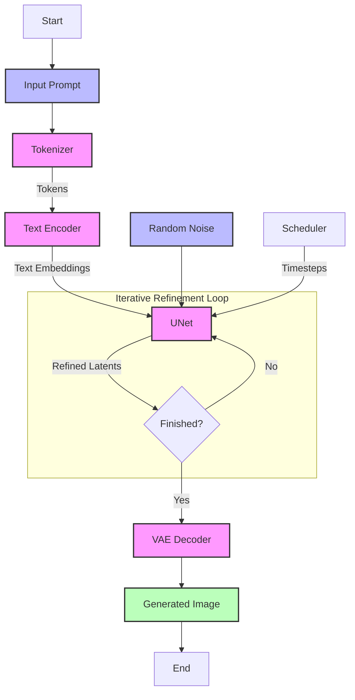

```mermaid
flowchart TD
    A[Start] --> B[Input Prompt]
    B --> C[Tokenizer]
    C --> |Tokens| D[Text Encoder]
    D --> |Text Embeddings| E[UNet]
    
    F[Random Noise] --> E
    G[Scheduler] --> |Timesteps| E
    
    E --> |Refined Latents| H{Finished?}
    H --> |No| E
    H --> |Yes| I[VAE Decoder]
    I --> J[Generated Image]
    J --> K[End]

    subgraph "Iterative Refinement Loop"
        E
        H
    end

    classDef process fill:#f9f,stroke:#333,stroke-width:2px;
    class C,D,E,I process;
    classDef input fill:#bbf,stroke:#333,stroke-width:2px;
    class B,F input;
    classDef output fill:#bfb,stroke:#333,stroke-width:2px;
    class J output;
```