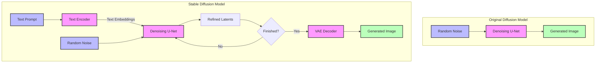

```mermaid
graph TD
    subgraph "Original Diffusion Model"
        A1[Random Noise] --> B1[Denoising U-Net]
        B1 --> C1[Generated Image]
    end

    subgraph "Stable Diffusion Model"
        A2[Text Prompt] --> B2[Text Encoder]
        B2 --> |Text Embeddings| C2[Denoising U-Net]
        D2[Random Noise] --> C2
        C2 --> E2[Refined Latents]
        E2 --> F2{Finished?}
        F2 -->|No| C2
        F2 -->|Yes| G2[VAE Decoder]
        G2 --> H2[Generated Image]
    end

    classDef input fill:#bbf,stroke:#333,stroke-width:2px;
    classDef process fill:#f9f,stroke:#333,stroke-width:2px;
    classDef output fill:#bfb,stroke:#333,stroke-width:2px;

    class A1,A2,D2 input;
    class B1,B2,C2,G2 process;
    class C1,H2 output;
```