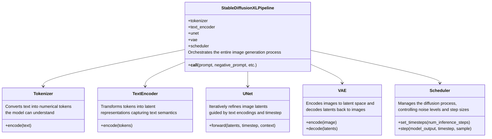

```mermaid
classDiagram
    class StableDiffusionXLPipeline {
        +tokenizer
        +text_encoder
        +unet
        +vae
        +scheduler
        +__call__(prompt, negative_prompt, etc.)
        Orchestrates the entire image generation process
    }

    class Tokenizer {
        +encode(text)
        Converts text into numerical tokens
        the model can understand
    }

    class TextEncoder {
        +encode(tokens)
        Transforms tokens into latent
        representations capturing text semantics
    }

    class UNet {
        +forward(latents, timestep, context)
        Iteratively refines image latents
        guided by text encodings and timestep
    }

    class VAE {
        +encode(image)
        +decode(latents)
        Encodes images to latent space and
        decodes latents back to images
    }

    class Scheduler {
        +set_timesteps(num_inference_steps)
        +step(model_output, timestep, sample)
        Manages the diffusion process,
        controlling noise levels and step sizes
    }

    StableDiffusionXLPipeline --> Tokenizer
    StableDiffusionXLPipeline --> TextEncoder
    StableDiffusionXLPipeline --> UNet
    StableDiffusionXLPipeline --> VAE
    StableDiffusionXLPipeline --> Scheduler
```