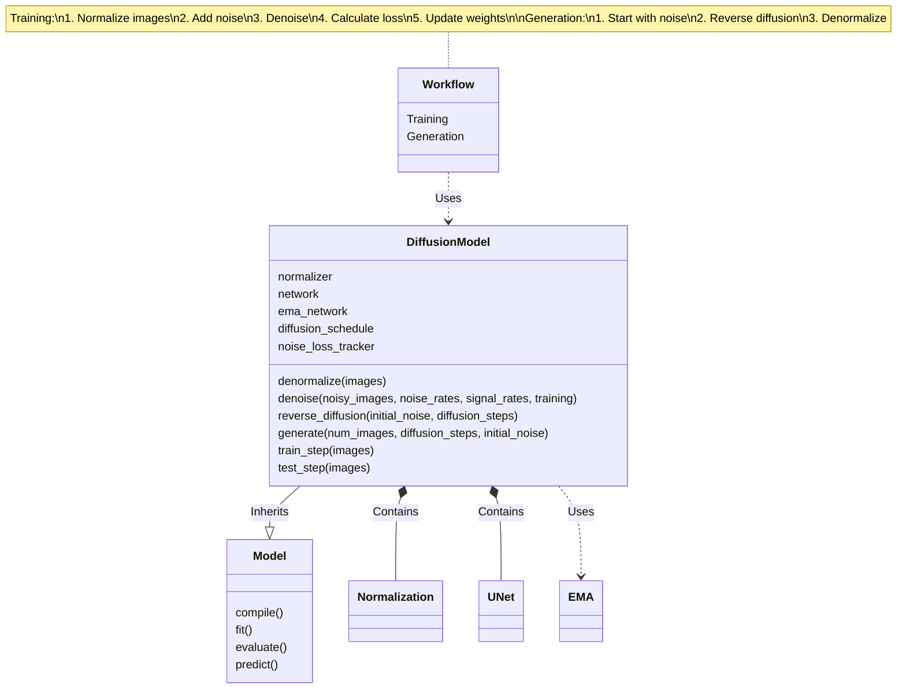

```mermaid
classDiagram
    class DiffusionModel {
        normalizer
        network
        ema_network
        diffusion_schedule
        noise_loss_tracker
        denormalize(images)
        denoise(noisy_images, noise_rates, signal_rates, training)
        reverse_diffusion(initial_noise, diffusion_steps)
        generate(num_images, diffusion_steps, initial_noise)
        train_step(images)
        test_step(images)
    }

    DiffusionModel --|> Model : Inherits

    class Model {
        compile()
        fit()
        evaluate()
        predict()
    }

    DiffusionModel *-- Normalization : Contains
    DiffusionModel *-- UNet : Contains
    DiffusionModel ..> EMA : Uses

    class Workflow {
        Training
        Generation
    }

    Workflow ..> DiffusionModel : Uses

    note for Workflow "Training:\n1. Normalize images\n2. Add noise\n3. Denoise\n4. Calculate loss\n5. Update weights\n\nGeneration:\n1. Start with noise\n2. Reverse diffusion\n3. Denormalize"
```
