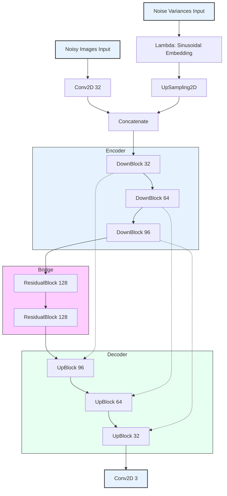

```mermaid
graph TD
    A[Noisy Images Input] --> B[Conv2D 32]
    C[Noise Variances Input] --> D[Lambda: Sinusoidal Embedding]
    D --> E[UpSampling2D]
    B & E --> F[Concatenate]
    F --> G[DownBlock 32]
    G --> H[DownBlock 64]
    H --> I[DownBlock 96]
    I --> J[ResidualBlock 128]
    J --> K[ResidualBlock 128]
    K --> L[UpBlock 96]
    L --> M[UpBlock 64]
    M --> N[UpBlock 32]
    N --> O[Conv2D 3]

    G -.-> L
    H -.-> M
    I -.-> N

    subgraph Encoder
        G
        H
        I
    end

    subgraph Bridge
        J
        K
    end

    subgraph Decoder
        L
        M
        N
    end

    style A fill:#e6f3ff,stroke:#333,stroke-width:2px
    style C fill:#e6f3ff,stroke:#333,stroke-width:2px
    style O fill:#e6f3ff,stroke:#333,stroke-width:2px
    style Encoder fill:#e6f3ff,stroke:#333,stroke-width:1px
    style Bridge fill:#fcf,stroke:#333,stroke-width:1px
    style Decoder fill:#e6fff0,stroke:#333,stroke-width:1px
```